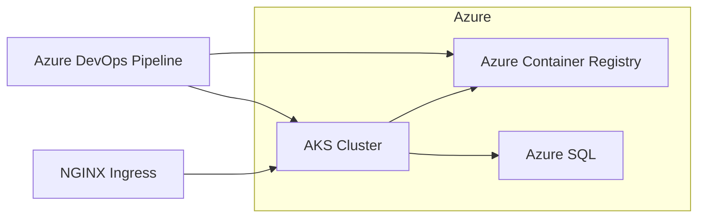

# aks-orchard-microservice

Multi-tenant [Orchard Core CMS](https://docs.orchardcore.net/) deployed to Azure Kubernetes Service (AKS).

## Architecture



Each tenant (alpha, bravo, charlie) runs as a separate Helm release with its own PVC and ingress host. All instances share a **single Azure SQL database** (`OrchardDb`); each instance uses a unique **table prefix** to keep its data isolated.

## Prerequisites

- Azure subscription with permissions to create RG, AKS, ACR, and Azure SQL
- [Terraform](https://www.terraform.io/) >= 1.5
- [kubectl](https://kubernetes.io/docs/tasks/tools/) and [Helm](https://helm.sh/) 3.x
- [.NET 8 SDK](https://dotnet.microsoft.com/download) (for local development)
- Azure DevOps project with:
  - **ACR service connection** (`orchard-acr-connection`)
  - **AKS service connection** (`orchard-aks-connection`)
  - Environments: `alpha`, `bravo`, `charlie`

## 1. Provision infrastructure

```bash
cd terraform
terraform init
terraform plan -var-file=environments/dev/terraform.tfvars
terraform apply -var-file=environments/dev/terraform.tfvars
```

Edit `terraform/environments/dev/terraform.tfvars` before applying:

- Set your `subscription_id`
- Choose globally unique names for `acr_name` and `sql_server_name`
- Set a strong `sql_admin_password`

Capture outputs:

```bash
terraform output acr_login_server
terraform output sql_server_fqdn
```

Configure kubectl:

```bash
az aks get-credentials --resource-group rg-orchard-aks-dev --name orchard-aks-dev
```

## 2. Install cluster add-ons

Install an ingress controller and (optionally) cert-manager before enabling ingress in Helm values:

```bash
helm repo add ingress-nginx https://kubernetes.github.io/ingress-nginx
helm install ingress-nginx ingress-nginx/ingress-nginx \
  --namespace ingress-nginx --create-namespace
```

Create the application namespace:

```bash
kubectl create namespace orchard
```

## 3. Build and push the container image

```bash
# Local build test
dotnet build OrchardSite.sln
docker build -t orchard:local .

# Push to ACR (after az acr login)
ACR=<your-acr-name>.azurecr.io
docker tag orchard:local $ACR/orchard:latest
docker push $ACR/orchard:latest
```

## 4. Configure tenant values

Set the shared database connection string once in `helm/orchard-chart/values.yaml`:

```yaml
database:
  connectionString: "Server=tcp:...;Database=OrchardDb;..."
```

Each instance file under `helm/orchard-chart/instances/` sets a **per-tenant admin password** and references the shared database:

| File | Tenant settings |
|---|---|
| `values-alpha.yaml` | `adminPassword`, `connectionStringRef: shared`, `tablePrefix: alpha_` |
| `values-bravo.yaml` | `adminPassword`, `connectionStringRef: shared`, `tablePrefix: bravo_` |
| `values-charlie.yaml` | `adminPassword`, `connectionStringRef: shared`, `tablePrefix: charlie_` |

`connectionStringRef: shared` tells the chart to use `database.connectionString` from `values.yaml` — all tenants connect to the same `OrchardDb` database. Each tenant's unique `tablePrefix` prevents table name collisions.

## 5. Deploy with Helm

```bash
helm upgrade --install orchard-alpha ./helm/orchard-chart \
  --namespace orchard \
  -f helm/orchard-chart/values.yaml \
  -f helm/orchard-chart/instances/values-alpha.yaml \
  --set image.repository=lgexample654.azurecr.io/myapp \
  --set image.tag=1.0
```

Repeat for `bravo` and `charlie`.

## 6. CI/CD pipelines

Two separate Azure DevOps pipelines live under `.pipelines/`:

| Pipeline file | Purpose |
|---|---|
| `azure-pipelines-terraform.yml` | Validates and applies Terraform (AKS, ACR, Azure SQL) |
| `azure-pipelines-helm.yml` | Builds the Docker image and deploys Helm releases to AKS |

### Terraform pipeline

Create a pipeline in Azure DevOps pointing at `.pipelines/azure-pipelines-terraform.yml`.

Required setup:

- **Azure service connection** (`orchard-azure-connection`) with Contributor on the subscription
- **Backend storage** — update the backend block in `terraform/main.tf` and the pipeline variables if your state storage differs
- **Environment** `terraform-dev` for apply approvals
- Run with **Apply** enabled via the `runApply` parameter (defaults to `false` — plan only)

### Helm pipeline

Create a pipeline in Azure DevOps pointing at `.pipelines/azure-pipelines-helm.yml`.

Required setup:

- **ACR service connection** (`orchard-acr-connection`)
- **AKS service connection** (`orchard-aks-connection`)
- **Environments** `alpha`, `bravo`, `charlie` for deployment approvals

The Helm pipeline validates charts, builds/pushes `lgexample654.azurecr.io/myapp:1.0`, then deploys each tenant.

## Project structure

```
├── Dockerfile                  # Multi-stage .NET 8 container build
├── OrchardSite.sln
├── src/
│   ├── OrchardSite.Web/        # Orchard Core CMS host
│   └── OrchardSite.Themes/     # Shared theme module
├── helm/orchard-chart/         # Per-tenant Helm chart
├── terraform/                  # AKS + ACR + Azure SQL
└── .pipelines/                 # Azure DevOps CI/CD
```

## Local development

```bash
dotnet restore OrchardSite.sln
dotnet run --project src/OrchardSite.Web
```

For local SQL, update `appsettings.json` with a valid connection string or use SQL Server in Docker.

## Security notes

- Do not commit real passwords; use Azure Key Vault + External Secrets Operator in production
- Helm instance values use placeholders (`CHANGE_ME`) — replace before deploying
- ACR admin is disabled; AKS pulls images via managed identity (AcrPull role)
